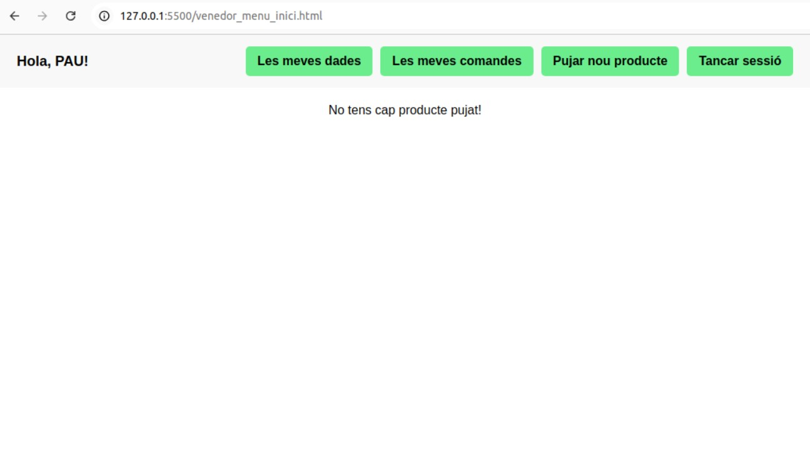
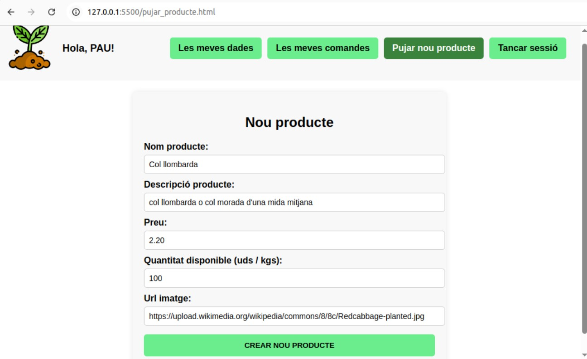

## README d'Angel per l'assignatura de Projecte. Segon projecte gener-maig 2025. 

# Main del repositori: https://github.com/angelspsv/projecte2_market_place.git

# Roc i jo compartim el mateix repositori. A continuació anomenaré quins fitxers i directoris són meus.

+ En el main del repositori (https://github.com/angelspsv/projecte2_market_place.git) hi ha una sèrie de directoris i fitxers html. Els fitxers html són meus i pertanyen a la part web del projecte.

+ En la carpeta api (https://github.com/angelspsv/projecte2_market_place/tree/main/api) estan els fitxers de la meva fastAPI amb el fitxer de connexió, les funcions i el main.py.

+ En la carpeta css_angel (https://github.com/angelspsv/projecte2_market_place/tree/main/css_angel) estan tots els fitxers css encarregats de donar estil a la pàgina web.

+ En la carpeta imatges_angel (https://github.com/angelspsv/projecte2_market_place/tree/main/imatges_angel) estan les imatges de la visualització de la web. També hi ha tres imatges utilitzades en el disseny de la web.

+ En la carpeta js_angel (https://github.com/angelspsv/projecte2_market_place/tree/main/js_angel) estan tots els fitxers javascript creats per la pàgina web.

+ En la carpeta wireframes_web (https://github.com/angelspsv/projecte2_market_place/tree/main/wireframes_web) estan els wireframes que vaig dissenyar al començament del projecte.

## Tasques realitzades en aquest projecte:

- intervenir en el disseny de la base de dades
- realitzar els wireframes web de baixa i alta fidelitat
- crear l'API i tots els endpoints que fa servir la pàgina web
- programar tot el codi de la pàgina web (fitxers: js, html i css)
- intervenir en la redacció de la memòria final del projecte
- intervenir en la creació de l'excel requeriments i casos de prova (https://docs.google.com/spreadsheets/d/12p8Ltpf-7BIqkJc8cvjYpvqa9SkM08cWD_kM25HuPcw/edit?usp=sharing) que en el nostre cas ve a substituir el Kanban, ja que vam veure ambas tasques molt semblants.
- intervenir en la creació de la guia d'estils bàsics per l'aplicació (https://docs.google.com/document/d/10MaYJP7TtTwaBtJmbL7QMlWNAMecu9scfLhi2Ok85r0/edit?usp=sharing)

## Altres enllaços:

+ Enllaç a la memòria del projecte en format word: https://docs.google.com/document/d/1BhFzjUOgs8S2WeY2fM5rBQGwfl9so3Q92bXR-wmLbqY/edit?usp=sharing

+ Enllaç de la presentació: https://docs.google.com/presentation/d/10kQsVXWAoQsBQMQdB0HtQi5R6Cux4_z4e4irVRibcoM/edit?usp=sharing

+ Enllaç al directori amb les actes de reunió dels diferents sprints: https://drive.google.com/drive/folders/1mIC2DBC-xDeaiddQLMnwmLmfx1EgdgBW?usp=sharing

+ Enllaç al full d'excel amb els requeriments i casos de prova: https://docs.google.com/spreadsheets/d/12p8Ltpf-7BIqkJc8cvjYpvqa9SkM08cWD_kM25HuPcw/edit?usp=sharing

+ Enllaç a la guia d'estils: https://docs.google.com/document/d/10MaYJP7TtTwaBtJmbL7QMlWNAMecu9scfLhi2Ok85r0/edit?usp=sharing

# Imatges de la visualització de la web

* Imatge 1: Pàgina d'inici de la web on apareixen les dos opcions: inici de sessió o crear un nou usuari. 

* Imatge 2: Pàgina de registre d'un nou usuari. L'usuari ha d'omplir tots els camps. Comarca i tipus d'usuari son camps de tipus select. 

* Imatge 3: Pàgina d'inici de sessió. L'usuari s'ha de identificar amb correu i contrasenya, si són correctes apareix un missatge i després es redirigit cap al menú d'inici d'usuari depent si aquest és comprador o venedor apareixeràn unes funcionalitats o d'altres. 

* Imatge 4: Pàgina d'inici del menú d'usuari que en aquest cas és d'un usuari comprador. La pàgina saluda a l'usuari gràcies a les cookies. Apareixen les funcionalitats: les meves dades, les meves comandes, tancar sessió i la cistella. Més abaix i al centre està el cercador inteligent que només oferirà productes de la mateixa comarca del comprador. 

* Imatge 5: Comprador està cercant productes amb "co". El cercador mostra els productes que contenen "co" dins del nom del producte i estan dins de la mateixa comarca. L'usuari ha de fer click a sobre un d'aquest productes. 

* Imatge 6: El comprador al fer click a sobre un d'aquest productes fa que el sistema mostri tots els productes del mateix venedor ja que en la nostra app les comandes es fan al mateix venedor. Llavors, un cop que es mostren tots els productes del mateix venedor també apareix l'opció de afegir quantitat a la cistella. 

* Imatge 7: El comprador fa click d'afegir un producte a la cistella. L'id del producte i la quantitat es desan al localStorage. L'usuari rep un missatge d'haver afegit correctament l'article a la cistella. 

* Imatge 8: Cistella resum: acabat d'afegir tots els productes i quantitas, l'usuari es dirigeix a la cistella (botó a dalt dreta) En aquest moment obtenim les dades del localStorage i preparem per confirmar els productes i quantitats o esborrar algun element. Apareix el preu total junt amb la comissió de servei. L'usuari està conforme i avança. 

* Imatge 9: Cistella pagament: l'usuari està en la darrera fase del procés de compra: ha d'omplir les seves dades bancaries més una franja d'entrega i l'adreça d'entrega. Quan l'usuari premi el botó 'pagar' es genera la comanda de compra: la cistella es buida, el venedor rep la comanda. L'usuari venedor es redirigit cap l'apartat: les meves comandes on hi apareixerà la darrera comanda feta. 

* Imatge 10: Comandes fetes del usuari comprador: l'usuari comprador pot veure totes les seves comandes en l'apartat 'les meves comandes' o surten dades com el nom del venedor, l'import, si la comanda està lliurada o dades bancàries.

* Imatge 11: Usuari edita les seves dades. Aquesta funcionalitat és idèntica tan per l'usuari comprador com pel venedor. Al anar a 'les meves dades' la pàgina carrega les dades actuals de l'usuari. Si aquest vol les pot editar i desar o tornar al menú d'inici d'usuari.

* Imatge 12: Usuari venedor arriba al menú d'inici. En aquest cas encara no té cap producte pujat. Els usuaris venedor tenen les funcionalitats de: pujar nou producte, les meves dades, les meves comandes (las comandes que ha rebut) i per suposat les opcions d'editar i esborrar articles quan en té. 

* Imatge 13: Usuari venedor puja un nou producte. El sistema valida els camps i si tot està ok crea el producte i porta l'usuari de nou al menú d'inici. 

* Imatge 14: Usuari venedor està al menú d'inici  i veu el(s) seu(s) product(es). En aquest cas té només un, el acaba de crear. En el mateix producte apareixen les opcions d'editar-ho o esborrar-ho. 

* Imatge 15: Usuari venedor vol editar un producte seu. Ha fet click al botó editar del producte i s'ha obert la pàgina per editar l'article. S'han carregat les dades actuals. El formulari valida les dades abans d'actualizar-les si finalment es fa click a actualitzar. 

* Imatge 16: Usuari venedor revisa les seves comandes, les comandes que ha rebut. El venedor rep el número de comanda, el nom del comprador, l'adreça on portar els productes i en quina franja horària. A partir del número de comanda es podrà accedir al detall per sapiguer quis productes i les quntitats ha de portar al comprador. 

* Imatge 17: Usuari vol sortir. L'usuari ha premiat el botó de tancar sessió, pero abans de sortir, la pàgina vol confirmació. Quan l'usuari abandona la pàgina s'elimina la cookie. 

* Imatge 18: El swagger de fastAPI on podem veure els endpoints que fa servir la web. 

------------------------Leyenda MarkDown------------------- lista no numerada: +/*/- Elemento 1 encabezado: ### Titulo 1 negrita: /texto en negrita/ cursiva: /texto cursiva/ enlace: Visita Google imagen desde archivo: 