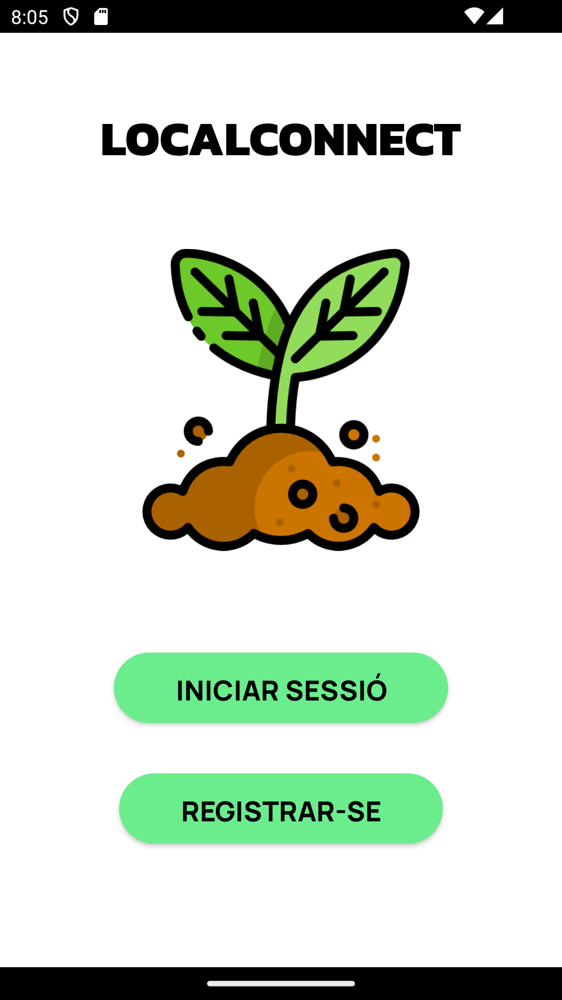
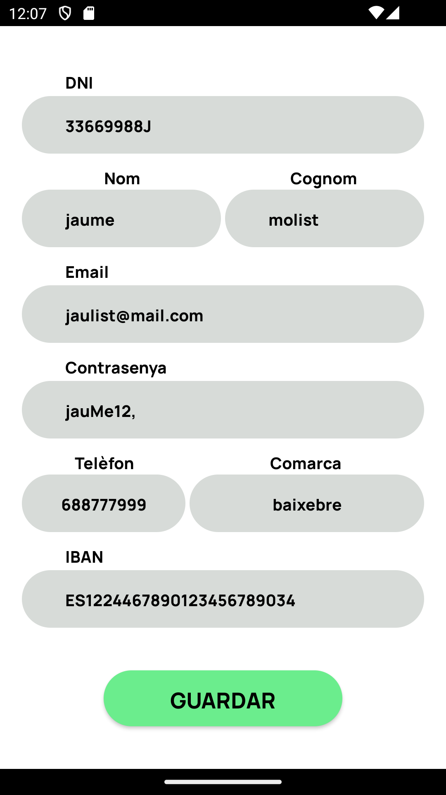

## README de Roc per l'assignatura de Projecte. Segon projecte gener-maig 2025.

# Main del repositori: https://github.com/angelspsv/projecte2_market_place.git

# L'Àngel i jo compartim el mateix repositori. A continuació anomenaré quins fitxers i directoris són meus:

+ En el main del repositori (https://github.com/angelspsv/projecte2_market_place.git) hi ha una carpeta aneomenada app que conté el codi de l'aplicació d'Android.
+ A la carpeta api_roc (https://github.com/angelspsv/projecte2_market_place/tree/roc/api_roc) es troben els fitxers de la fastAPI corresponent per a l'app mobile (connection.py, functions.py i el main.py).
+ En la carpeta imatges_roc (https://github.com/angelspsv/projecte2_market_place/tree/roc/imatges_roc) estan les imatges de les vistes de l'aplicació.

## Tasques realitzades en aquest projecte:

- Intervenir en el disseny de la base de dades
- Dissenyar els prototips tant d'alta com de baixa fidelitat de l'aplicació mobile
- Crear l'API per l'app mobile i tots els endpoints que fa servir aquesta
- Programar tot el codi de l'aplicació amb Android Studio
- Intervenir en la redacció de la memòria final del projecte
- Intervenir en la creació de l'excel requeriments i casos de prova (https://docs.google.com/spreadsheets/d/12p8Ltpf-7BIqkJc8cvjYpvqa9SkM08cWD_kM25HuPcw/edit?usp=sharing) que en el nostre cas ve a substituir el Kanban, ja que vam veure ambdues tasques molt semblants
- Intervenir en la creació de la guia d'estils bàsics per l'aplicació (https://docs.google.com/document/d/10MaYJP7TtTwaBtJmbL7QMlWNAMecu9scfLhi2Ok85r0/edit?usp=sharing)

## Enllaços:

+ Enllaç a la memòria del projecte en format word: https://docs.google.com/document/d/1BhFzjUOgs8S2WeY2fM5rBQGwfl9so3Q92bXR-wmLbqY/edit?usp=sharing
+ Enllaç de la presentació: https://docs.google.com/presentation/d/10kQsVXWAoQsBQMQdB0HtQi5R6Cux4_z4e4irVRibcoM/edit?usp=sharing
+ Enllaç al directori amb les actes de reunió dels diferents sprints: https://drive.google.com/drive/folders/1mIC2DBC-xDeaiddQLMnwmLmfx1EgdgBW?usp=sharing
+ Enllaç al full d'excel amb els requeriments i casos de prova: https://docs.google.com/spreadsheets/d/12p8Ltpf-7BIqkJc8cvjYpvqa9SkM08cWD_kM25HuPcw/edit?usp=sharing
+ Enllaç a la guia d'estils: https://docs.google.com/document/d/10MaYJP7TtTwaBtJmbL7QMlWNAMecu9scfLhi2Ok85r0/edit?usp=sharing

# Vistes de l'aplicació

## Pàgina d’inici

Aquesta vista ens mostra el logo de l’aplicació i el nom, a part de dos botons. Els botons tenen la funcionalitat de portar-nos a la vista d’inici de sessió o a la de registre. Si l’usuari ja té un compte creat escollirà el botó d’inici de sessió, i sinó seleccionarà el de registrar-se.

## Inici de sessió

Aquesta vista permet a l’usuari introduir el seu correu i la contrasenya corresponent. L’aplicació crida a l’API per comprovar les dades introduïdes. Si son correctes, redirigeix la vista a la pàgina d’inici corresponent de l’usuari. Si no son correctes, mostra un Toast indicant el motiu de l’error (camps buits, format incorrecte, credencials no coincidents…).

## Registre

La funcionalitat de registre està dividida en dues vistes, amb la finalitat de facilitar el procés d’introducció de dades. Primerament, l’usuari selecciona quin tipus de perfil vol crear. Aquesta informació s’emmagatzema internament i es mostra una altra vista amb un formulari on l’usuari indicarà les seves dades personals.

Tota la informació introduïda als camps del formulari és validada per certes normes depenent de cada camp (el DNI ha de tenir 8 dígits i una lletra, l’email ha de tenir un format vàlid, el telèfon no pot contenir lletres…). Un cop l’usuari prem el botó de registrar-se l’app el redirigeix a l'activitat d’inici de sessió.

## Pàgina d’inici comprador

Al iniciar sessió amb un usuari de tipus comprador es mostra aquesta pàgina en la que podem veure una llista dels diferents productes disponibles, juntament amb el seu nom i el seu preu. Dins de cada producte hi ha un botó per afegir-ne la quantitat desitjada i un altre per disminuir la quantitat ja introduïda. A dalt a la dreta trobem un botó que ens portarà a la vista del cistell de la compra.

## Pàgina d’inici venedor

Al iniciar sessió amb un usuari de tipus venedor es mostra aquesta pàgina en la que podem veure una llista dels diferents productes que oferim i un resum de les seves dades. Al prémer a sobre de cadascun dels productes ens mostra directament la vista d’edició del producte seleccionat. A més a més, a la part dreta superior trobem un botó que ens dirigeix a la vista de creació de producte.

## Vista de perfil

Mitjançant el menú de navegació situat a la part inferior de la pantalla, els usuaris poden accedir a l’apartat de perfil. En aquesta vista podem veure una petita salutació amb el nom de l’usuari, la seva foto de perfil, i dos botons.

El botó d’editar perfil ens porta a la vista d’edició de perfil, mentre que el de tancar sessió esborra les dades de sessió de l'usuari actual i ens porta a la activitat d’inici de sessió.

## Edició de perfil

En aquesta activitat els usuaris poden modificar les seves dades personals. Tots els camps passen per un procés de validació que comprova que no estiguin buits i que les dades introduïdes siguin correctes (el DNI ha de tenir 8 dígits i una lletra, l’email ha de tenir un format vàlid, el telèfon no pot contenir lletres…). En prémer el botó de guardar es fan les validacions i, si no hi ha cap error, es persisteixen les dades corresponents a la base de dades.

## Creació de producte

Aquesta activitat permet a l'usuari venedor crear un producte nou. Abans d’enviar les dades introduïdes per l’usuari, aquestes passen per certes normes de validació. Els camps obligatoris no poden estar buits, i a part, el preu i l’estoc han de ser números positius. Al prémer el botó de guardar es fan les comprovacions mencionades i es persisteix el nou objecte a la base de dades.

## Edició i esborrament de producte

L’usuari venedor pot editar o eliminar els seus productes mitjançant aquesta vista. Després de seleccionar el producte desde la seva pàgina d’inici, es mostra un formulari amb les dades d’aquest, les quals poden ser editades per l’usuari.

Abans d’enviar les dades introduïdes per l’usuari, aquestes passen per certes normes de validació. Els camps obligatoris no poden estar buits, i a part, el preu i l’estoc han de ser números positius. Al prémer el botó de guardar es fan les comprovacions mencionades i es persisteix el nou objecte a la base de dades. El botó d’eliminar simplement esborra el producte de la base de dades.

## Endpoints utilitzats

Seguidament es mostra un captura corresponent al Swagger de l’API implementada per a l’aplicació mòbil, en el que es poden veure tots els endpoints que consumeix aquesta:

